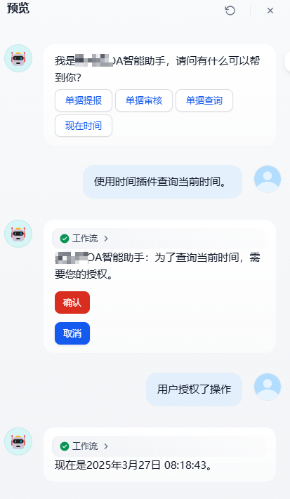

# 禁如何在 dify 上创建 OA 智能助手？

> 前言：<br/>
> 2025 年可谓是 AI 元年，万物都可以接入 AI，用以给用户带来更加便捷的体验。<br/>
> 于是乎，公司里骨灰级的 OA 系统也被拉出来进行一番改造。

## 准备工作

1. 部署 dify
2. 部署 Ollama 运行一个模型

## 技术难点

### 如何让 dify 提供交互式操作

考虑到用户体验，调用 OA 系统接口时，最好要求明确用户授权。确认操作如果用对话的方式，略显繁琐。

故而我们可以使用 dify 的模板能力，使用 jinja2 模板语法即可提供交互式操作的能力。

下面是 dify 支持的表单类型

```txt
  TEXT = 'text',
  PASSWORD = 'password',
  EMAIL = 'email',
  NUMBER = 'number',
  DATE = 'date',
  TIME = 'time',
  DATETIME = 'datetime',
  CHECKBOX = 'checkbox',
  SELECT = 'select',
```

例如要求用户授权，我们只需添加一个模板节点

模版内容

```js
<button data-message="用户授权了操作" data-variant="warning">确认</button>
<button data-message="用户取消了操作" data-variant="primary">取消</button>
```

利用 `data-message` 设置要给大模型传递的信息，用户在点选按钮后，即会将这个 message 发送给大模型，完成授权操作。


