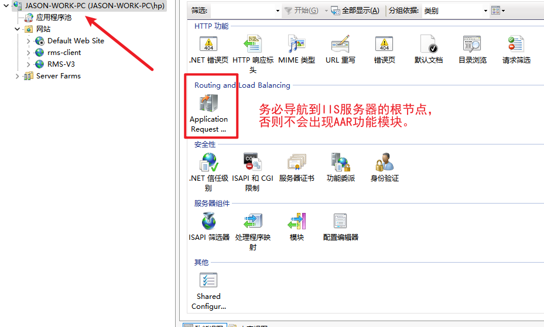
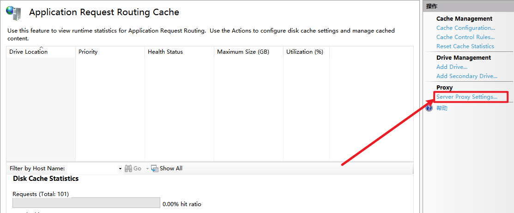
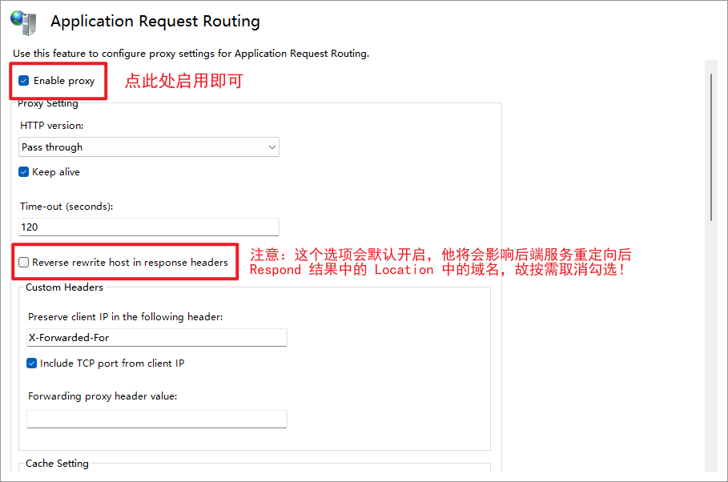

# IIS Rewrite

> 目前还有些公司使用 IIS 服务器作为主力部署容器。
> 在部署一些简单站点的时候，遇到跨域问题，在不开放 Cookie 跨域共享权限，和借助 nginx 类反向代理工具的条件下，解决跨域问题

## [URL Rewrite](https://iis-umbraco.azurewebsites.net/downloads/microsoft/url-rewrite)

该插件可以允许使用正则匹配的模式，对请求进行重定向。

```json
<rewrite>
     <rules>
         <rule name="Rule Name" stopProcessing="true">
             <match url="^api/(.*)" /> // 正则匹配的规则
             // type是在安装 AAR 之后可以使用 Rewrite
             // redirectType 实际上就是客户端收到的状态码是301或302
             <action type="Redirect" url="http://DOMAIN/api/{R:1}" redirectType="Permanent" />
     </rules>
</rewrite>
```

## [AAR](https://iis-umbraco.azurewebsites.net/downloads/microsoft/application-request-routing)

该插件要基于 url-rewrite 安装后使用，可以实现地址重写、负载均衡、不停机更新。

### 地址重写

结合 url-rewrite 可以实现正则匹配模式的地址重写，避免 301 或 302 再次触发浏览器的跨域策略。

```json
<rewrite>
     <rules>
         <rule name="Rule Name" stopProcessing="true">
             <match url="^api/(.*)" />
             <action type="Rewrite" url="http://DOMAIN/api/{R:1}" />
     </rules>
</rewrite>

<proxy>
    <preserveHostHeader>true</preserveHostHeader>
</proxy>
```

## 配置步骤

由于要求前端 `img` 标签需要带用户凭据，授权访问。`img` 标签难以干预，故而使用重写地址的方式实现`demo.createsome.fun/api/xxx` 重写到 `demowebapi.createsome.fun/api/xxx`

1. 安装 rewrite
2. 管理员模式下 cmd 运行 `net stop was /y`
3. 安装 RRA
4. 管理员模式下 cmd 运行 `net start was`
5. 管理员模式下 powershell 执行 iisreset
6. 修改 web.config 配置，或者在 IIS 面板上添加重写规则

   ```json
   <?xml version="1.0" encoding="utf-8"?>
   <configuration>
   <location path="." inheritInChildApplications="false">
    <system.webServer>
   	   <rewrite>
            <rules>
                <rule name="API Rules" stopProcessing="true">
                    <match url="^api/(.*)" />
                    <action type="Rewrite" url="http://demowebapi.createsome.fun/api/{R:1}" redirectType="Permanent" />
                </rule>
            </rules>
        </rewrite>
   		<proxy>
            <preserveHostHeader>true</preserveHostHeader>
        </proxy>
    </system.webServer>
   </location>
   </configuration>
   ```

7. 启用 AAR <Badge type="danger" text="注意" />   

### 禁用 ARR 的 Location 头重写

| 方案               | 操作                                                                                               | 适用情况                     |
| ------------------ | -------------------------------------------------------------------------------------------------- | ---------------------------- |
| **方法 1（推荐）** | 关闭 ARR 的 `Reverse rewrite host in response headers`                                             | IIS 全局配置，适用于所有请求 |
| **方法 2（推荐）** | `web.config` 中 `<reverseRewriteHostInResponseHeaders>false</reverseRewriteHostInResponseHeaders>` | 只对特定站点生效             |
| **方法 3**         | `Outbound Rules` 直接修改 `Location` 头                                                            | 适用于更复杂的 URL 处理      |
